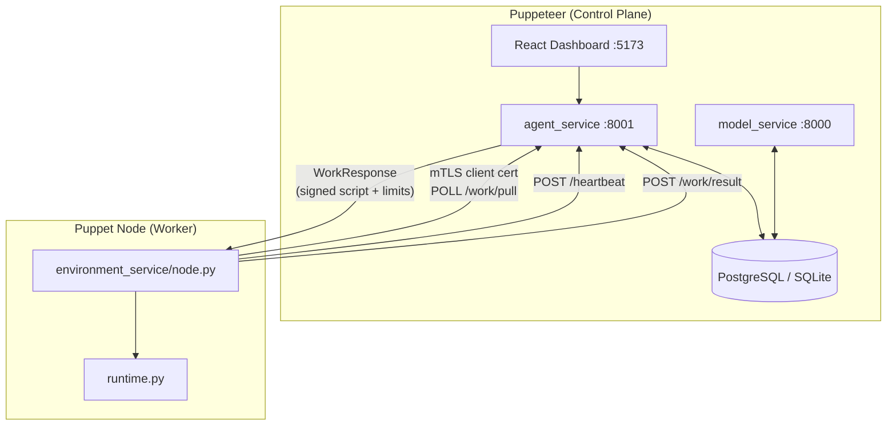
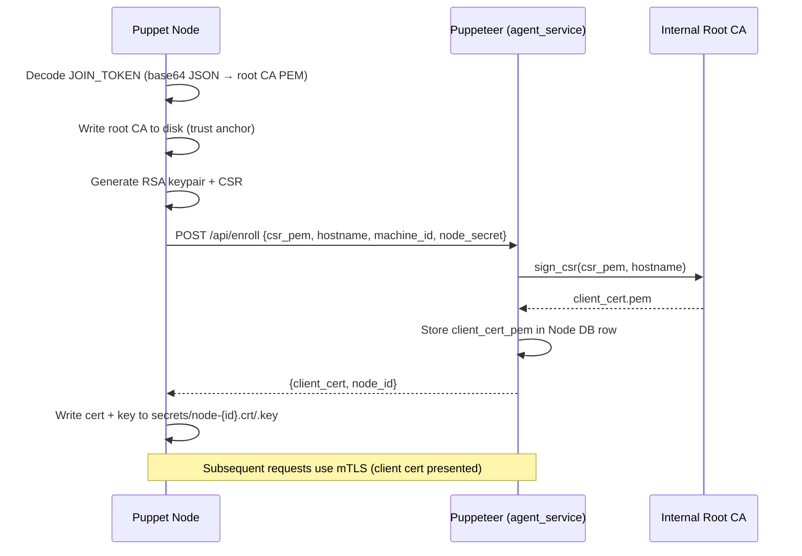

<objective>
Enable Mermaid diagram rendering in mkdocs.yml and write the full technical architecture guide for Master of Puppets.

Purpose: DEVDOC-01 — developers and contributors need a comprehensive reference that explains every system component, the security model, and how data flows end-to-end, with Mermaid diagrams that render in the browser without external CDN calls.

Output:
- `docs/mkdocs.yml` — updated with `markdown_extensions` (Mermaid via pymdownx.superfences) and a `Developer:` nav section pointing to architecture.md
- `docs/docs/developer/architecture.md` — full technical deep-dive guide (300+ lines)
</objective>

<execution_context>
@/home/thomas/.claude/get-shit-done/workflows/execute-plan.md
@/home/thomas/.claude/get-shit-done/templates/summary.md
</execution_context>

<context>
@.planning/PROJECT.md
@.planning/ROADMAP.md
@.planning/STATE.md
@.planning/phases/22-developer-documentation/22-CONTEXT.md
@.planning/phases/22-developer-documentation/22-RESEARCH.md
</context>

<interfaces>
<!-- Current mkdocs.yml — executor must preserve all existing config and append to it -->
<!-- From docs/mkdocs.yml: -->
```yaml
site_name: Master of Puppets
site_url: https://dev.master-of-puppets.work/docs/
theme:
  name: material
  palette:
    scheme: slate
    primary: indigo
    accent: indigo
plugins:
  - search
  - privacy
  - offline
  - swagger-ui-tag
```
<!-- The nav: key does not yet exist — must be added -->
<!-- The markdown_extensions: key does not yet exist — must be added -->

<!-- Services to document (from puppeteer/agent_service/services/): -->
<!-- agent_service (main.py :8001), model_service (:8000), job_service, foundry_service,
     scheduler_service, pki_service, signature_service, smelter_service, vault_service,
     alert_service, webhook_service, trigger_service, mirror_service, staging_service -->

<!-- Key DB tables: jobs, nodes, node_stats, scheduled_jobs, signatures, users,
     user_signing_keys, user_api_keys, service_principals, role_permissions,
     blueprints, puppet_templates, capability_matrix, approved_ingredients,
     audit_log, revoked_certs, execution_records, triggers, webhooks, tokens, config -->
</interfaces>

<tasks>

<task type="auto">
  <name>Task 1: Enable Mermaid in mkdocs.yml and add Developer nav section</name>
  <files>docs/mkdocs.yml</files>
  <action>
Update `docs/mkdocs.yml` by appending two new top-level keys.

Add `markdown_extensions:` block for Mermaid support:
```yaml
markdown_extensions:
  - pymdownx.superfences:
      custom_fences:
        - name: mermaid
          class: mermaid
          format: !!python/name:pymdownx.superfences.fence_code_format
```

Add `nav:` section (with Developer pointing to the file created in Task 2, and API Reference pointing to the existing file):
```yaml
nav:
  - Home: index.md
  - Developer:
    - Architecture: developer/architecture.md
  - API Reference:
    - Overview: api-reference/index.md
```

Note: Setup & Deployment and Contributing nav entries will be added by Plans 02 and 03. Only add Architecture for now — mkdocs build --strict requires all listed files to exist on disk. Do NOT list developer/setup-deployment.md or developer/contributing.md yet.

Preserve all existing keys exactly as they are (site_name, site_url, theme, plugins).
  </action>
  <verify>
    <automated>cd /home/thomas/Development/master_of_puppets/docs && grep -c "pymdownx.superfences" mkdocs.yml && grep -c "developer/architecture.md" mkdocs.yml</automated>
  </verify>
  <done>mkdocs.yml contains pymdownx.superfences custom_fences config and a nav entry for developer/architecture.md</done>
</task>

<task type="auto">
  <name>Task 2: Write the full architecture guide</name>
  <files>docs/docs/developer/architecture.md</files>
  <action>
Create `docs/docs/developer/` directory and write `architecture.md` — a full technical deep-dive guide (300+ lines). Write fresh from scratch, do not port from legacy files.

Required sections (in this order):

**1. Overview** — 2-paragraph intro + system overview Mermaid diagram showing all services:


**2. Service Inventory** — table + prose description for each service:
- agent_service (main.py, port 8001): FastAPI control plane — all API routes, WebSocket, PKI, job dispatch
- model_service (port 8000): APScheduler-backed cron scheduling service, separate process
- job_service: job assignment, node selection (capability matching, memory admission, tag filtering), heartbeat processing, execution records
- foundry_service: Docker image builds from templates + blueprints, max 2 concurrent builds (semaphore), Smelter enforcement
- scheduler_service: cron job CRUD, APScheduler integration, stats/history pruning
- pki_service: PKI lifecycle helpers (wraps pki.py CertificateAuthority)
- signature_service: Ed25519 public key storage and verification
- smelter_service: approved ingredient registry, blueprint validation, STRICT/WARNING enforcement
- vault_service: binary artifact storage with SHA-256 hashing
- alert_service: job failure/node offline/tamper alerting
- webhook_service: HMAC-signed outbound webhook delivery
- trigger_service: webhook-triggered job dispatch (slug + secret token)
- mirror_service: PyPI/APT mirror management for air-gap builds
- staging_service: job definition staging + approval workflow

**3. Database Schema** — Mermaid erDiagram + table descriptions for all key tables. Use an erDiagram showing the relationships between jobs, nodes, scheduled_jobs, puppet_templates, blueprints, users, role_permissions, signatures, execution_records, audit_log. (Use a focused diagram — not all 30 tables, but the core 10-12.)

**4. Security Model** — with mTLS enrollment sequence diagram and Ed25519 signing chain explanation:

mTLS enrollment sequence (use the diagram from RESEARCH.md):


Subsections:
- mTLS cert lifecycle (enrollment, revocation via RevokedCert table, CRL at /system/crl.pem)
- Ed25519 signing chain (operator generates keypair → uploads public key to Signatures → signs scripts → nodes verify before executing)
- JWT + token versioning (token_version on User incremented on password change, invalidating prior sessions; tv field in JWT)
- RBAC permission model (role_permissions table, three roles: admin/operator/viewer, require_permission() factory)
- Fernet encryption at rest (ENCRYPTION_KEY env var, job secrets encrypted in DB)

**5. Job Execution Data Flow** — with job execution sequence diagram (use the diagram from RESEARCH.md with OP → D → A → N → R → A → D):

**6. Foundry & Smelter** — Mermaid flowchart showing: Blueprint (RUNTIME + NETWORK) → Template → Foundry build → Smelter validation → Docker image → Puppet node. Explain:
- Blueprint model: two types (RUNTIME defines packages/tools, NETWORK defines network config), JSON definition, os_family
- Template model: combines a RUNTIME + NETWORK blueprint, gets built into a Docker image
- Foundry build pipeline (foundry_service.py): copies environment_service/ to temp dir, generates Dockerfile with capability_matrix injection recipes, runs `docker build`
- Smelter: approved_ingredients table, CVE scanning, STRICT mode fails build on violation
- Image lifecycle: ACTIVE / DEPRECATED / REVOKED states

**7. Pull Model Architecture** — explain WHY nodes poll (no inbound firewall rules needed), how the pull model works with heartbeats, WorkResponse, and result reporting. Contrast with push model and its firewall implications.

Use MkDocs Material admonition boxes (e.g., `!!! note`, `!!! warning`, `!!! tip`) where appropriate. Use tables for service inventory and env vars. Every Mermaid diagram must use triple-backtick mermaid fences.
  </action>
  <verify>
    <automated>cd /home/thomas/Development/master_of_puppets && grep -c '```mermaid' docs/docs/developer/architecture.md && wc -l docs/docs/developer/architecture.md</automated>
  </verify>
  <done>architecture.md exists with 300+ lines and at least 4 mermaid code fences; Docker build passes (run `docker build -f docs/Dockerfile . --no-cache` to confirm — this is the phase gate, not required per-task)</done>
</task>

</tasks>

<verification>
1. `grep -c "pymdownx.superfences" docs/mkdocs.yml` → 1
2. `grep -c "developer/architecture.md" docs/mkdocs.yml` → 1
3. `grep -c '```mermaid' docs/docs/developer/architecture.md` → 4 or more
4. `wc -l docs/docs/developer/architecture.md` → 300+ lines
5. Architecture guide contains all required service names: agent_service, model_service, job_service, foundry_service, scheduler_service, pki_service, signature_service, smelter_service
6. Architecture guide contains security model subsections: mTLS, Ed25519, JWT, RBAC, Fernet
</verification>

<success_criteria>
- docs/mkdocs.yml has Mermaid config (pymdownx.superfences custom_fences) and nav entry for developer/architecture.md
- docs/docs/developer/architecture.md exists with 300+ lines and 4+ Mermaid diagrams
- All 8 primary services documented with purpose and role
- Security model section covers all 5 security mechanisms (mTLS, Ed25519, JWT+token_version, RBAC, Fernet)
- Foundry & Smelter section explains blueprint → template → build → image lifecycle pipeline
</success_criteria>

<output>
After completion, create `.planning/phases/22-developer-documentation/22-01-SUMMARY.md` following the summary template.
</output>
