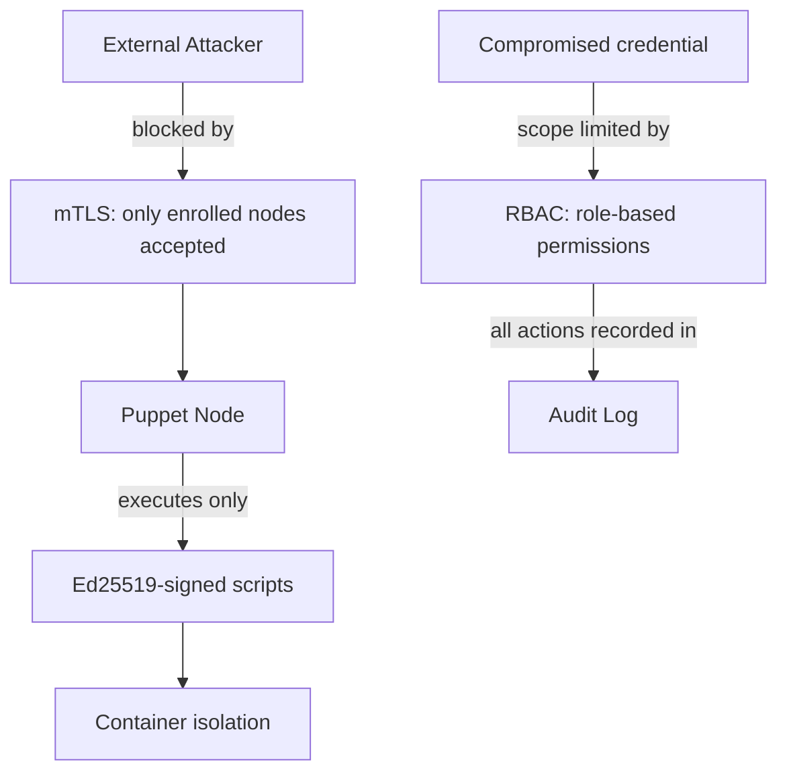

<objective>
Write the Security Overview page and the mTLS & Certificates guide (SECU-01).

Purpose: The Security Overview frames the entire section. The mTLS guide is the most technically complex page in this phase — it requires PKI background boxes, a step-by-step rotation procedure, and safety admonitions that protect operators from irreversible mistakes.
Output: security/index.md fully rewritten (was stub), security/mtls.md fully written from stub.
</objective>

<execution_context>
@/home/thomas/.claude/get-shit-done/workflows/execute-plan.md
@/home/thomas/.claude/get-shit-done/templates/summary.md
</execution_context>

<context>
@.planning/PROJECT.md
@.planning/phases/24-extended-feature-guides-security/24-CONTEXT.md
@.planning/phases/24-extended-feature-guides-security/24-RESEARCH.md
@.planning/phases/24-extended-feature-guides-security/24-02-SUMMARY.md
@.planning/phases/24-extended-feature-guides-security/24-03-SUMMARY.md

<interfaces>
<!-- Source-of-truth PKI facts. Extracted from pki.py and main.py. -->

### Root CA parameters (pki.py)
- Key algorithm: RSA 4096-bit
- Signature algorithm: SHA-256
- Validity: 3650 days (10 years)
- Subject CN: "Master of Puppets Root CA"
- Subject Org: "Bambibanners"
- CA directory (self-managed): `secrets/ca/`
- Files: `root.key` (CA private key), `root.crt` (CA certificate)
- Mounted at: `/app/global_certs/` when cert-manager sidecar is active

### Node client cert parameters (pki.py sign_csr())
- Validity: **825 days** (~2.25 years)
- Signature algorithm: SHA-256
- CN: hostname from CSR
- BasicConstraints: CA=False

### CRL (pki.py generate_crl())
- Next update interval: **7 days**
- Format: PEM-encoded X.509 CRL
- Endpoint: `GET /system/crl.pem` (unauthenticated)
- `RevokedCert` table: `serial_number`, `node_id`, `revoked_at`

### Enrollment flow (confirmed from codebase)
1. Node decodes `JOIN_TOKEN` (base64 JSON containing Root CA PEM)
2. Node generates RSA private key + CSR
3. Node sends CSR to `POST /api/enroll`
4. Server signs CSR → returns PEM cert
5. Node stores cert in `secrets/` volume
6. Node uses cert for all subsequent `/work/pull` and `/heartbeat` calls

### Revocation effect (main.py)
- Revoked nodes: 403 at `/work/pull` AND `/api/enroll`
- `Node.status` set to `"OFFLINE"` on revocation
- Serial number recorded in `RevokedCert` table

### PKI CA path fallback (pki_service.py)
- If `/app/global_certs/root_ca.crt` exists → uses cert-manager CA
- Otherwise → self-managed CA in `secrets/ca/`
- Default Docker Compose: self-managed CA path (no cert-manager sidecar by default)

### Cert rotation procedure (no automated tooling — manual only)
1. Generate a new JOIN_TOKEN (Admin → System → Generate Join Token)
2. Stop the node container
3. Delete the node's `secrets/` volume (or the specific `node-*.crt` and `node-*.key` files inside it)
4. Start the node with the new JOIN_TOKEN — it will re-enroll and get a new cert
5. Verify the node appears as Active in the **Nodes** dashboard
6. Revoke the old cert: **Admin** → **Nodes** → select old node → **Revoke**
7. Verify revocation: `curl https://<HOST>/system/crl.pem` and confirm the old serial appears in the CRL

### Compromise Scenarios (from CONTEXT.md — requested by user)
| Scenario | Controls That Limit Damage |
|----------|---------------------------|
| Orchestrator compromised | Ed25519 signing requirement: attacker cannot create valid signed scripts without the private keys |
| Node compromised | mTLS: compromised node cert can be immediately revoked; container isolation: node runs scripts inside containers, not directly on host |
| Credential leaked (JWT/API key) | `token_version`: password change immediately invalidates all tokens for that user; API key can be revoked in dashboard |

### Mermaid pattern from architecture.md (Phase 22)
Use `graph TD` (top-down flowchart). Avoid `sequenceDiagram` for defence-in-depth model — simpler syntax, less prone to strict-mode issues.

### Writing conventions (locked decisions)
- Define PKI terms on first use: CA (Certificate Authority), CRL (Certificate Revocation List), CSR (Certificate Signing Request)
- Background boxes (`!!! info`) before complex procedures
- `!!! danger` for hard limits / irreversible actions
- `!!! warning` for operational risks
- `<PLACEHOLDER>` for sensitive values
- No screenshots — reference UI labels in bold
</interfaces>
</context>

<tasks>

<task type="auto">
  <name>Task 1: Write security/index.md — Security Overview</name>
  <files>docs/docs/security/index.md</files>
  <action>
Replace the stub content with the full Security Overview page. This page frames the entire Security section.

**H1: Security Overview**

Opening paragraph (2-3 sentences): Master of Puppets implements defence-in-depth security — multiple independent layers that each limit the blast radius of a compromise. The controls work together: a compromised credential does not grant script execution, and a compromised node cannot inject unsigned code.

Second paragraph: Frame the four controls by the threat each mitigates:
- **mTLS certificates** — ensure only enrolled nodes can poll for work and report results; an attacker cannot impersonate a node without a valid client certificate
- **Ed25519 job signing** — ensure only scripts signed by a registered key can execute; even full orchestrator access cannot create an unsigned executable job
- **RBAC** — limits the blast radius of a compromised human account; a viewer account cannot submit jobs or modify the platform
- **Audit log** — provides tamper-evident evidence of all security-relevant actions for forensic and compliance use

**Mermaid diagram** — defence-in-depth layers (use `graph TD` syntax):



Adjust diagram as needed for clarity — the key relationships to show are:
1. mTLS gates node-to-orchestrator communication
2. Ed25519 gates script execution
3. RBAC limits scope of a compromised credential
4. All actions feed into the audit log

**H2: Compromise Scenarios**

Brief intro: "The table below describes what an attacker can and cannot do in common compromise scenarios."

| Scenario | What the attacker gains | Controls that limit damage |
|----------|------------------------|---------------------------|
| Orchestrator compromised | Access to job queue, node list, scheduled definitions | Ed25519 signing: cannot create valid signed scripts without private keys; keys are stored outside the orchestrator |
| Node compromised | Ability to poll for work on that node | Certificate revocation immediately blocks the compromised node; container isolation prevents host-level escape |
| JWT or API key leaked | Access matching the token's role | `token_version`: password change immediately invalidates all tokens; API key can be revoked from dashboard |
| Database compromised | Encrypted secrets, hashed passwords | Fernet encryption protects secrets at rest; bcrypt hashes cannot be reversed to recover passwords |

**H2: Security Guides**

"This section covers the following topics:"

- [mTLS & Certificates](mtls.md) — Root CA setup, node enrollment, certificate revocation, and cert rotation
- [RBAC Hardening](rbac-hardening.md) — Least-privilege configuration, permission audit, and hardening recommendations
- [Audit Log](audit-log.md) — Event inventory, access patterns, and compliance reporting
- [Air-Gap Operation](air-gap.md) — Deploying in network-isolated environments with offline package mirrors
  </action>
  <verify>
    <automated>grep -c "mermaid\|Compromise\|mtls\|rbac-hardening\|audit-log\|air-gap" /home/thomas/Development/master_of_puppets/docs/docs/security/index.md</automated>
  </verify>
  <done>security/index.md fully written (60+ lines), Mermaid diagram present, Compromise Scenarios table present with 4 rows, links to all 4 sub-guides; mkdocs build clean</done>
</task>

<task type="auto">
  <name>Task 2: Write security/mtls.md — mTLS and Certificates guide</name>
  <files>docs/docs/security/mtls.md</files>
  <action>
Replace the stub with the full mTLS & Certificates guide. Audience: novice operator with no PKI background. Define all terms on first use.

**H1: mTLS & Certificates**

Opening: "Mutual TLS (mTLS) is a security protocol where both parties in a connection — the orchestrator and each puppet node — present certificates to prove their identity. Unlike standard TLS, where only the server is verified, mTLS also verifies the client."

**Background box** (`!!! info "PKI Terminology"`): Define CA, CSR, CRL, enrollment, and certificate serial number in 1-2 sentences each before the first procedure.

---

**H2: How MoP Uses mTLS**

Briefly explain:
- The orchestrator operates a Root Certificate Authority (CA) that signs all node certificates
- Nodes enroll by sending a Certificate Signing Request (CSR) and receiving a signed certificate
- Every `/work/pull` and `/heartbeat` call requires the node to present its client certificate
- Revoked certificates are tracked in a Certificate Revocation List (CRL) served at `/system/crl.pem`

**H2: The Root CA**

"The Root CA is the trust anchor for the entire fleet. It is created automatically when the orchestrator starts for the first time."

CA parameters:
- Key: RSA 4096-bit
- Validity: 10 years (3650 days)
- Location: `secrets/ca/root.key` (private key) and `secrets/ca/root.crt` (certificate)

Add `!!! danger`: "The Root CA private key (`secrets/ca/root.key`) is the most sensitive file in the deployment. Anyone with access to this file can enroll arbitrary nodes. Back it up to offline storage and restrict filesystem access."

Note on cert-manager: "For advanced deployments using Kubernetes cert-manager, the CA is loaded from `/app/global_certs/root_ca.crt`. The Docker Compose deployment uses the self-managed CA path described here."

**H2: The JOIN_TOKEN**

Define: "The `JOIN_TOKEN` is a base64-encoded JSON object containing the Root CA certificate. Nodes use it to establish trust with the orchestrator on first contact."

Generate a join token:
1. Navigate to **Admin** → **System**
2. Click **Generate Join Token**
3. Copy the token — it contains the Root CA certificate embedded

Usage:
```bash
JOIN_TOKEN=<YOUR_JOIN_TOKEN> docker compose -f node-compose.yaml up -d
```

Add `!!! warning`: "The JOIN_TOKEN contains the public Root CA certificate — it is not itself a secret. However, any node that receives it can enroll. Do not share it beyond nodes you intend to enroll."

**H2: Node Enrollment**

Explain the automatic enrollment flow in numbered steps (novice-friendly prose):
1. The node container starts and reads `JOIN_TOKEN` from its environment
2. It decodes the token to extract the Root CA certificate and uses it to establish a trusted TLS connection to the orchestrator
3. The node generates a new RSA private key and creates a Certificate Signing Request (CSR) with its hostname as the Common Name (CN)
4. The node sends the CSR to `POST /api/enroll` on the orchestrator
5. The orchestrator signs the CSR and returns a client certificate valid for **825 days** (~2.25 years)
6. The node stores the certificate in its `secrets/` volume and uses it for all subsequent communication

"After enrollment, the node appears in **Nodes** with status **Active**. If enrollment fails (for example, because the JOIN_TOKEN is malformed or the orchestrator is unreachable), the container exits and logs the error."

**H2: Certificate Revocation**

"Revoking a certificate immediately blocks that node from polling for work or re-enrolling."

Steps to revoke a node:
1. Navigate to **Nodes** in the dashboard
2. Find the node and click **Revoke**
3. Confirm the revocation

Effect:
- The node's `status` is set to `OFFLINE`
- Its certificate serial is added to the Certificate Revocation List (CRL)
- All subsequent `/work/pull` and `/api/enroll` requests from that node return HTTP 403

CRL is available at `GET /system/crl.pem` (unauthenticated, so nodes can fetch it) and refreshes every 7 days.

Add `!!! danger`: "Revoking a certificate is permanent. The node cannot re-enroll using the same certificate. If the node container is still running, it will receive 403 errors until it is stopped."

**H2: Certificate Rotation**

"Node certificates are valid for 825 days. Before a certificate expires, rotate it by re-enrolling the node with a new certificate."

**Prerequisites checklist** (as a Markdown task list — operator must verify before starting):
```markdown
Before starting cert rotation, confirm:

- [ ] You have access to stop and restart the node container
- [ ] You have the orchestrator admin credentials
- [ ] The node is not currently running a critical job (check the Jobs view)
```

Rotation procedure (numbered steps):

1. **Generate a new JOIN_TOKEN**: In the dashboard, navigate to **Admin** → **System** → **Generate Join Token**. Copy the new token.

2. **Stop the node container**:
   ```bash
   docker compose -f node-compose.yaml down
   ```

3. **Delete the node's certificate files**:
   ```bash
   rm -f secrets/node-*.crt secrets/node-*.key
   ```
   Add `!!! tip`: "This forces the node to generate a new identity on next start. The node ID (derived from the cert CN) changes — the orchestrator will register it as a new enrollment."

4. **Start the node with the new JOIN_TOKEN**:
   ```bash
   JOIN_TOKEN=<NEW_JOIN_TOKEN> docker compose -f node-compose.yaml up -d
   ```

5. **Verify the node has enrolled**: In the dashboard, navigate to **Nodes** and confirm the node appears with status **Active**. The node's last-seen timestamp should be within the last minute.

Add `!!! danger "Point of no return"`: "**Do not proceed to step 6 until you have confirmed the node is Active in the dashboard.** After step 6, the old certificate is permanently revoked. If the new enrollment has not succeeded, the node will be unable to re-enroll."

6. **Revoke the old certificate**: In the dashboard, find the previous node entry (it may appear as **Offline**) and click **Revoke**.

7. **Verify the CRL**:
   ```bash
   curl -s https://<YOUR_HOST>/system/crl.pem
   ```
   The response should be a PEM-encoded CRL. Confirm the old node no longer appears as Active in the dashboard.

Add `!!! tip`: "If the node appears as a separate entry (different name or UUID) after rotation, it is because the old and new entries have different hostnames. Delete the old offline entry from the Nodes view after confirming the new node is active."

Cross-link footer: "For the system architecture context behind mTLS, see [Architecture](../developer/architecture.md). For deploying the orchestrator with TLS configured, see [Setup & Deployment](../developer/setup-deployment.md)."
  </action>
  <verify>
    <automated>cd /home/thomas/Development/master_of_puppets/docs && mkdocs build 2>&1 | grep -i "documentation file" | wc -l</automated>
  </verify>
  <done>security/mtls.md fully written (120+ lines), covers Root CA (10yr), node cert validity (825 days), CRL (7 days), enrollment flow, revocation, rotation procedure with prerequisites checklist and danger admonition at point-of-no-return; all PKI terms defined on first use; mkdocs build clean</done>
</task>

</tasks>

<verification>
After both tasks complete:
1. `wc -l docs/docs/security/index.md` — should be 60+ lines
2. `wc -l docs/docs/security/mtls.md` — should be 120+ lines
3. `grep "mermaid" docs/docs/security/index.md` — Mermaid code block present
4. `grep "Compromise" docs/docs/security/index.md` — Compromise Scenarios table present
5. `grep "825" docs/docs/security/mtls.md` — correct cert validity documented
6. `grep "danger" docs/docs/security/mtls.md` — at least 2 danger admonitions (CA key + point-of-no-return)
7. `grep -i "before starting\|prerequisites" docs/docs/security/mtls.md` — prerequisites checklist present
8. `cd docs && mkdocs build 2>&1 | grep -i "documentation file"` — empty output
</verification>

<success_criteria>
- security/index.md: Mermaid diagram, Compromise Scenarios table (4 rows), links to all 4 sub-guides
- security/mtls.md: PKI terms defined on first use, Root CA params (10yr/RSA4096), node cert (825 days), CRL (7 days), 7-step rotation procedure, prereq checklist + danger admonition at step 6
- mkdocs build clean
</success_criteria>

<output>
After completion, create `.planning/phases/24-extended-feature-guides-security/24-04-SUMMARY.md`
</output>
