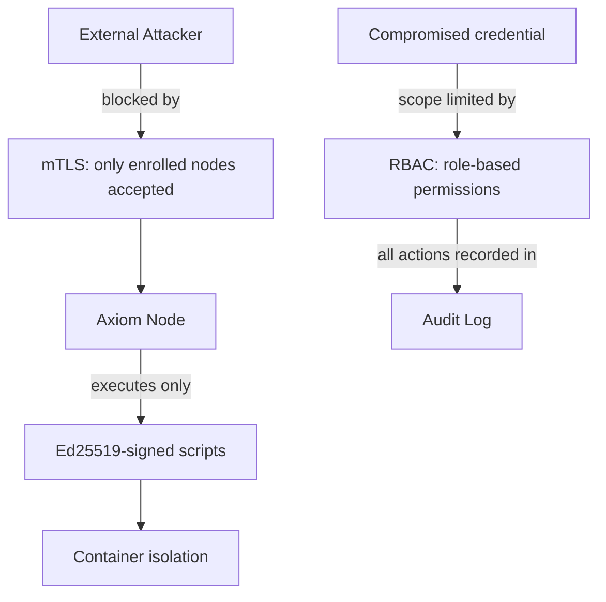

# Security Overview

Axiom implements defence-in-depth security — multiple independent layers that each limit the blast radius of a compromise. The controls work together: a compromised credential does not grant script execution, and a compromised node cannot inject unsigned code.

Each security control targets a specific threat:

- **mTLS certificates** — ensure only enrolled nodes can poll for work and report results; an attacker cannot impersonate a node without a valid client certificate signed by the orchestrator's Root CA
- **Ed25519 job signing** — ensure only scripts signed by a registered key can execute; even full orchestrator access cannot create an unsigned executable job because the private signing key lives outside the orchestrator
- **RBAC** — limits the blast radius of a compromised human account; a viewer account cannot submit jobs or modify the platform, and an operator account cannot access user management or system configuration
- **Audit log** — provides tamper-evident evidence of all security-relevant actions for forensic and compliance use; every authentication event, node revocation, and job dispatch is recorded with timestamp and actor identity

## Defence-in-Depth Model

The diagram below shows how the four layers interact. Each layer is independent: bypassing one does not grant access past the next.

The key relationships are:

1. **mTLS** gates node-to-orchestrator communication — no unenrolled client can reach the work queue
2. **Ed25519 signing** gates script execution — a node will refuse to run any script that fails signature verification
3. **RBAC** constrains what a logged-in user can do — permission checks apply to every API endpoint
4. **Audit log** records all security-relevant events — provides visibility if the other layers are tested or probed

## How the Controls Fit Together

Consider a scenario where an attacker has obtained valid dashboard credentials. With RBAC in place, a viewer-role attacker cannot submit jobs, modify node configuration, or access user management. Even if they escalated to operator, they cannot submit a job with an unsigned script — the Ed25519 verification check runs on the node before execution. Even if they somehow obtained a signing key, they would need a node's client certificate to deliver the job via the mTLS-protected work queue. At every stage, a separate key material or credential stands in the way.

This layering means that an attacker who compromises one component faces additional barriers before reaching the next. It also means that revocation or key rotation in one layer (for example, revoking a node certificate) does not require rotating all other credentials.

## Compromise Scenarios

The table below describes what an attacker can and cannot do in common compromise scenarios. The "Controls that limit damage" column identifies which layer restricts the attacker's ability to cause further harm.

| Scenario | What the attacker gains | Controls that limit damage |
|----------|------------------------|---------------------------|
| Orchestrator compromised | Access to job queue, node list, scheduled definitions | Ed25519 signing: cannot create valid signed scripts without private keys; keys are stored outside the orchestrator |
| Node compromised | Ability to poll for work on that node | Certificate revocation immediately blocks the compromised node; container isolation prevents host-level escape |
| JWT or API key leaked | Access matching the token's role | `token_version`: password change immediately invalidates all tokens; API key can be revoked from dashboard |
| Database compromised | Encrypted secrets, hashed passwords | Fernet encryption protects secrets at rest; bcrypt hashes cannot be reversed to recover passwords |

## Security Guides

This section covers the following topics in detail:

- [mTLS & Certificates](mtls.md) — Root CA setup, JOIN_TOKEN generation, node enrollment, certificate revocation, and the full cert rotation procedure
- [RBAC Hardening](rbac-hardening.md) — Least-privilege configuration, permission audit, and hardening recommendations
- [Audit Log](audit-log.md) — Event inventory, access patterns, and compliance reporting
- [Air-Gap Operation](air-gap.md) — Deploying in network-isolated environments with offline package mirrors

For the underlying system architecture that these controls protect, see the [Architecture](../developer/architecture.md) guide. For initial deployment configuration including TLS and secrets, see [Setup & Deployment](../developer/setup-deployment.md).
