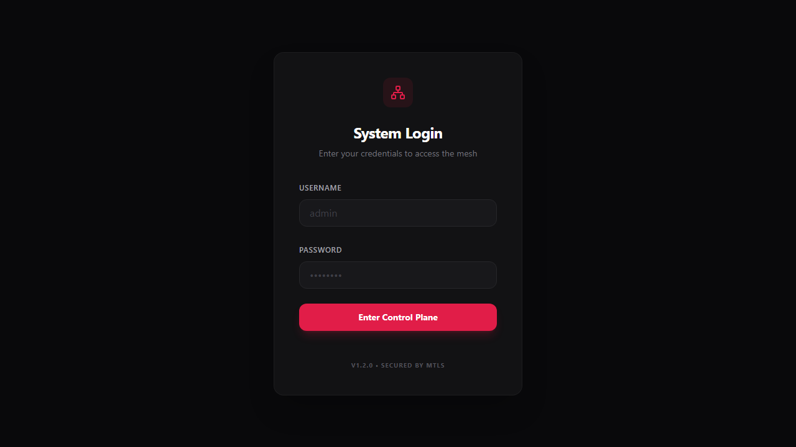
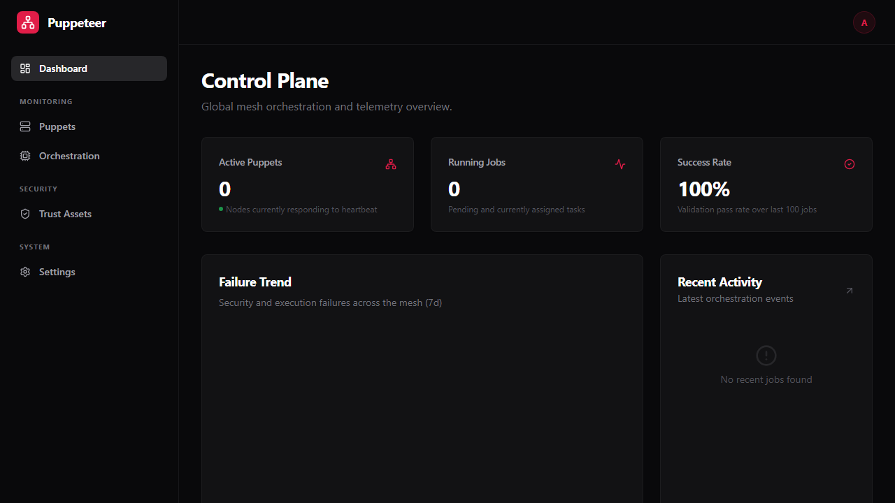
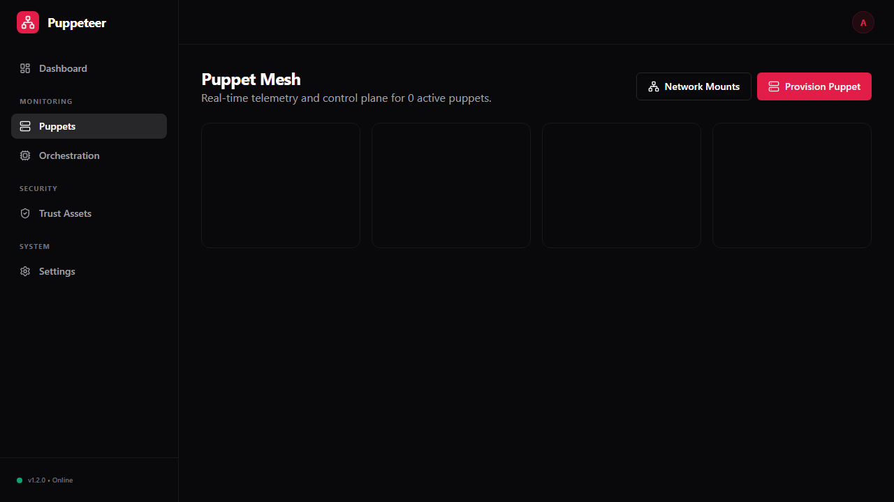
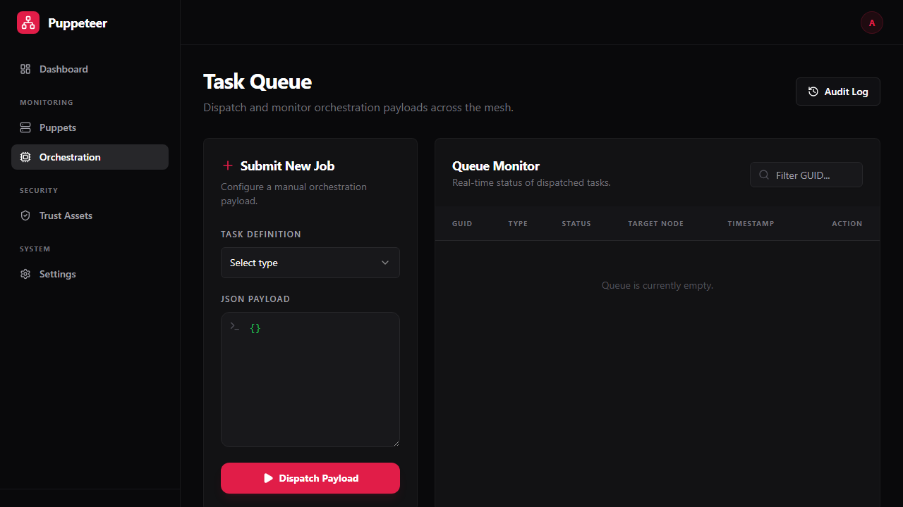
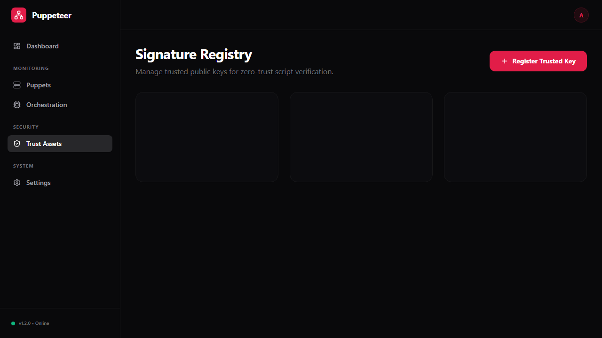
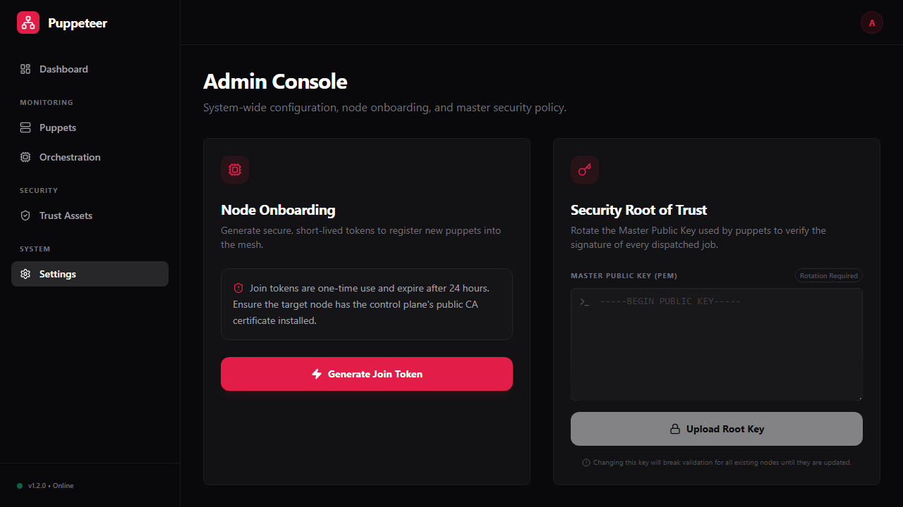

# Master of Puppets - Visual User Guide

This guide provides a visual walkthrough of the Master of Puppets Control Plane and how to perform key operations.

## 1. System Access
To access the mesh, you must first authenticate with the Control Plane.

## 2. Global Dashboard
Once logged in, the Dashboard provides a high-level overview of mesh health, including active puppets, success rates, and failure trends.

## 3. Node Management (Puppets)
The Puppets view allows you to monitor real-time telemetry from every node in the mesh, including CPU/RAM usage and authorization status.

### Onboarding a New Puppet
1. Navigate to the **Settings** (Admin) page.
2. Click **Generate Join Token**.
3. Use the token with the universal installer as described in the [User Guide](../../../docs/UserGuide.md).

## 4. Orchestration (Jobs)
The Orchestration page is where you dispatch and monitor job execution across the mesh.

### Scheduling a Job
1. Click **Submit New Job**.
2. Select the Task Type (e.g., Python Script).
3. Provide the JSON payload and script source.
4. Click **Dispatch Payload**.

## 5. Trust Registry (Signatures)
Zero-Trust execution requires every script to be cryptographically signed. Manage your trusted public keys here.

## 6. System Configuration (Settings)
Administrators can manage global security policies, rotation of root keys, and node onboarding tokens.

